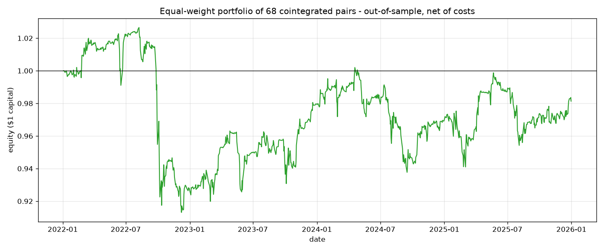
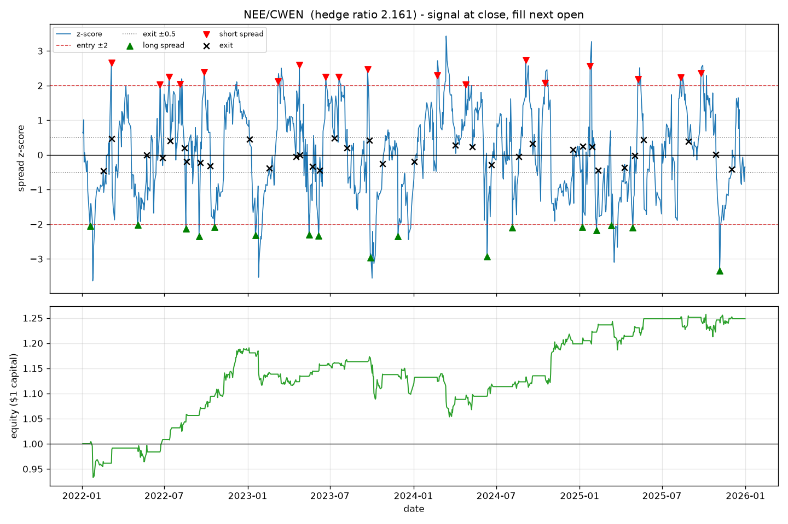

# Pairs Trading Research Platform: US Utilities

[](https://github.com/NirajNamburi/pairs-trading-research-platform/actions/workflows/ci.yml)

A research platform for statistical-arbitrage pairs strategies, in Python, with a worked study on
the **50 largest US utility stocks by market capitalisation** that have a continuous 2019-2025
price history. It screens every pair for cointegration with the full four-step Engle-Granger
procedure, trades the spread with a rolling z-score signal, backtests **out of sample** with
slippage and commissions, and ships a Streamlit viewer for inspecting pairs, signals and trades.
It is a research tool, not a trading system: nothing here connects to a broker.

**Headline result.** Done properly, the screen finds nothing. After dropping the seven utilities
whose own prices were stationary over the formation period, 33 of 903 pairs pass the
cointegration test at p < 0.05 against about 45 expected by chance at the nominal 5%. The 23
tradeable pairs lose money out of sample: Sharpe **-0.40 net of costs**, and a statistically
insignificant **+0.50 with costs switched off**. The naive screen, which skips the unit-root
pretest, reported 94 cointegrated pairs and looked like a success. Of those 94 passes, 79
involved one of the seven stocks the pretest removes, and 71 involved one of just three
(Dominion, AEP, PG&E) that were stationary on their own; on the same single orientation the
remaining 43 stocks produce only 15 passes (33 when both orientations are tested). That
correction, and the tooling to make it visible, is the substance of this project.



## Results

Formation (screening) period 2019-01-01 to 2021-12-31 (757 trading days). Out-of-sample trading
period 2022-01-03 to 2025-12-31 (1,003 trading days). Universe of 50 tickers; 43 survive the
unit-root pretest; 903 pairs tested; 23 backtested.

### The corrected screen against the naive one

| | Corrected (default) | Naive |
|---|---|---|
| Unit-root pretest on each stock | yes, 7 of 50 dropped | no |
| Orientations tested per pair | both, keep the stronger | alphabetical only |
| Pairs tested | 903 | 1,225 |
| Passed p < 0.05 | 33 (3.7%) | 94 (7.7%) |
| Expected by chance at 5% | 45 | 61 |
| Positive hedge ratio, backtested | 23 | 68 |
| Portfolio Sharpe, net of costs | **-0.40** | -0.09 |
| Portfolio Sharpe, zero costs | 0.50 | 0.36 |
| Max drawdown, net | -6.2% | -11.1% |
| Trades | 716 | 2,167 |

Both screens use the same universe, dates, signal and costs; only the screening method
differs. Full outputs for the naive run are in [`reports/naive_screen/`](reports/naive_screen/).
Note that testing both orientations and keeping the better one raises the effective chance rate
above the nominal 5%: on independent random walks the rule passes roughly 8 to 9% of pairs
(about 75 of 903, not 45; see [Design decisions](#design-decisions)), so 33 of 903 is, if anything,
further below chance than the table shows. The single-orientation variant in the sensitivity
table passes only 15.

### The strategy on the 23 pairs that pass

| Equal-weight portfolio, all 23 pairs | 10 bps slippage + 5 bps commission (default) | 5 bps + 5 bps | Zero costs |
|---|---|---|---|
| Sharpe ratio (annualised, rf = 0) | **-0.40** | -0.10 | 0.50 |
| Annualised return on allocated capital | -1.05% | -0.27% | 1.30% |
| Max drawdown | -6.2% | -4.9% | -3.8% |
| Pairs profitable | 10 / 23 | 10 / 23 | 12 / 23 |
| Win rate | 59.4% | 61.0% | 63.8% |
| Trades | 716 | 716 | 716 |
| Average holding period | 14.7 trading days | same | same |

On the portfolio's capital the strategy earned **5.2%** gross over four years and paid **9.4%**
in slippage and commissions: costs were 181% of gross profit. The typical trade works (median
+74 bps gross in 12 days) but the average gross gain is only 17 bps against a 30 bps round-trip
cost, because a tail of spreads that never converge drags the mean down. Even the zero-cost
Sharpe of 0.50 has a standard error of about 0.5 over four years on 23 overlapping pairs, so it
is not evidence of an edge.

| Year | Portfolio P&L, net |
|---|---|
| 2022 | -4.7% |
| 2023 | +1.1% |
| 2024 | -0.3% |
| 2025 | -0.3% |

The best single pair, NextEra regressed on Clearway Energy, returned 25% with a Sharpe of 0.68
over 35 trades. It is shown because it is the best, which is exactly why it should not be read as
representative; Clearway appears in 5 of the 23 pairs.



Full outputs are in [`reports/`](reports/): the [pretest table](reports/unit_root_pretest.csv),
all [screened pairs](reports/screened_pairs.csv), the ranked
[pair table](reports/pair_results.csv), every [trade](reports/trades.csv) and a
[JSON summary](reports/summary.json).

### What the pretest removed, and why it matters

Engle-Granger assumes each price series is a random walk (integrated of order one). Its second
stage regresses one series on the other and tests whether the residual is stationary. If the
regressand is *already* stationary on its own, the residual is essentially the regressand
itself: its test statistic is close to that stock's own ADF statistic whatever the partner, and
the test "passes" without any relationship between the two stocks. (With the stationary stock as
the regressor the residual stays close to a random walk and the test rarely passes: 2 of 98
such pairs in the naive run, below the 5% chance rate. In the alphabetical naive screen AEP and
Dominion were nearly always the regressand: they passed as regressand in 30 of 48 and 25 of 37
pairs, and as regressor in 0 of 1 and 0 of 12.)

Seven of the 50 utilities reject a unit root on their own 2019-2021 prices at p < 0.05. Price
levels in the table are the dividend-adjusted closes the pipeline tests, not traded prices:

| Ticker | ADF p-value (levels) | What happened in 2019-2021 |
|---|---|---|
| Dominion (D) | 0.004 | dividend cut and asset sale in July 2020, then flat |
| AEP | 0.005 | adjusted close rose from 56 to 75 in 2019, spiked to 83 and fell to 56 in Feb-Mar 2020, then ranged 58-76 |
| PG&E (PCG) | 0.006 | Chapter 11 filed January 2019; fell from 23 to 3.73 by October 2019 with several 100%+ swings in between, then traded 7-18 in 2020 and 8-12 in 2021, ending at half its starting price |
| Sempra (SRE) | 0.013 | |
| Atmos (ATO) | 0.018 | |
| Entergy (ETR) | 0.040 | |
| CMS Energy | 0.044 | |

Only the first three produced the artefact in bulk because the residual test uses the stricter
Engle-Granger critical value (-3.34 at 5%, against -2.87 for a plain ADF test): Dominion, AEP
and PG&E's own ADF statistics (-3.71, -3.64, -3.61) clear it, the other four's (-2.91 to -3.34)
barely or not at all. In the naive screen the first three appeared in 71 of the 94 passing
pairs, and AEP was in 28 of the 68 backtested pairs, so that portfolio was largely a bet on AEP
and Dominion oscillating. Note also that a 5% pretest wrongly drops about one genuine random
walk in twenty; PPL survived at p = 0.054. Raising the threshold to 10% drops twelve tickers and
does not change the conclusion (see the sensitivity table).

Of the 33 pairs that pass the corrected screen, 10 have a negative hedge ratio, meaning the two
stocks moved in opposite directions during formation. Between two utilities that is a symptom of
one having a crisis, not a relationship to trade, so those are excluded too.

### Sensitivity

| Variant | Dropped by pretest | Passed p < 0.05 (chance) | Backtested | Profitable | Sharpe | Trades |
|---|---|---|---|---|---|---|
| Baseline (pretest 5%, both orientations, window 30, entry 2.0, exit 0.5, 10 + 5 bps) | 7 | 33 (45) | 23 | 10 | -0.40 | 716 |
| 5 bps slippage instead of 10 | 7 | 33 (45) | 23 | 10 | -0.10 | 716 |
| Zero costs | 7 | 33 (45) | 23 | 12 | 0.50 | 716 |
| Window 20 | 7 | 33 (45) | 23 | 6 | -1.01 | 887 |
| Window 60 | 7 | 33 (45) | 23 | 12 | 0.68 | 426 |
| Entry 1.5 | 7 | 33 (45) | 23 | 8 | -0.59 | 1,000 |
| Entry 2.5 | 7 | 33 (45) | 23 | 10 | -0.23 | 375 |
| p-value < 0.01 | 7 | 7 (9) | 6 | 4 | 0.21 | 184 |
| Pretest at 10% instead of 5% | 12 | 23 (35) | 17 | 8 | -0.20 | 525 |
| Alphabetical orientation only | 7 | 15 (45) | 13 | 8 | 0.07 | 404 |
| Naive screen (no pretest, one orientation) | 0 | 94 (61) | 68 | 37 | -0.09 | 2,167 |

The variants that trade more (window 20, entry 1.5) do markedly worse; the 60-day window trades
40% less and has the best Sharpe at default costs (0.68 on 426 trades), but on 23 pairs over
four years that is still within noise of zero. No variant of the corrected screen finds more
pairs than chance would produce; only the naive screen does, for the reason given in the pretest
section.

### What the results mean

1. **The naive result was a statistical artefact, not a finding.** Skipping the unit-root
   pretest let three stocks that were stationary on their own pass with roughly half of their
   partners (AEP 30 of 49, Dominion 25, PG&E 18, against about 2.5 expected by chance). The
   corrected screen's pass rate (3.7%) is below the 5% false-positive rate of the test itself.
   In this universe and period there is no evidence of exploitable pairwise cointegration.
2. **Library functions implement the calculation, not the assumptions.** `coint()` does steps 2
   to 4 of Engle-Granger and never checks step 1. The method's precondition was the caller's
   responsibility. That is the lesson of this project.
3. **Costs would have killed it anyway.** Even the pairs that pass lose 30 bps per round trip
   against 17 bps of average gross convergence. Both variants that trade more than the baseline
   on the same 23 pairs (window 20, entry 1.5) lose more than it, and every variant that trades
   less does better.
4. **A sector chosen on a flawed screen is still a fair test bed.** See the next section.

## Why utilities, and what the correction did to that reasoning

The sector was chosen from evidence that turned out to be the artefact. The same pipeline was
first run on 89 S&P 500 stocks across three sectors, pairing only within each sector, and
utilities showed the highest pass rate (7.9% against 5.8% for energy and 3.9% for financials).
With the corrected screen, on the same dates and 5 bps slippage (outputs in
[`reports/comparison_sp500_sectors/`](reports/comparison_sp500_sectors/)):

| Sector (S&P 500 only) | Dropped by pretest | Pairs tested | Passed p < 0.05 | Pass rate | Profitable / backtested |
|---|---|---|---|---|---|
| Energy | 0 | 171 | 11 | 6.4% | 0 / 11 |
| Financials | 0 | 861 | 45 | 5.2% | 24 / 45 |
| Utilities | 6 | 231 | 7 | 3.0% | 4 / 6 |

Across the three sectors 63 pairs pass against 63 expected by chance, and the portfolio's Sharpe
is -0.04. The six stocks the pretest removes are all utilities (Dominion, AEP, Sempra, Atmos,
Entergy, CMS), which is why utilities looked best before the correction and worst after it.
Regulated utilities remain the sector where pairs *should* work, because the businesses are so
similar, so it is a fair place to ask the question; the answer for 2019-2025 is no.

## The universe: how the 50 were chosen

The list is generated by a script, not typed by hand, so "top 50 by market cap with a full
price history" is a claim you can audit and rerun:

```bash
pip install -e ".[universe]"
python -m pairs_trading.universe_selection --n 50 --start 2019-01-01 --end 2025-12-31
```

1. **Candidates:** every company in the GICS Utilities sector of the S&P 500, S&P MidCap 400
   and S&P SmallCap 600, read from Wikipedia's constituent tables. 60 listings, 59 companies
   after collapsing share classes.
2. **Eligibility:** a continuous daily price history over 2019 to 2025 (at most 2% of trading
   days missing). Constellation Energy ($92 billion, which would rank third; separated from
   Exelon on 1 February 2022) and Talen Energy ($14 billion; relisted June 2023) fail this and
   are excluded.
3. **Ranking:** market capitalisation from Yahoo Finance on the selection date (2026-09-16),
   descending; take the top 50. Seven eligible small caps fall below the cut.

The result is committed as [`utilities_top50.json`](src/pairs_trading/universes/utilities_top50.json)
with every member's rank, market cap and index, and every excluded candidate's reason. The 50
span $3.1 billion to $168 billion in market cap (median $20 billion): 30 from the S&P 500, 14
from the MidCap 400, 6 from the SmallCap 600; by sub-industry 18 electric, 17 multi-utility,
8 gas, 3 water, 2 independent power producers and 2 renewable generators.

Two caveats are stated rather than hidden. Market caps and index membership are as of the
selection date, not 2019, so the universe is tilted toward companies that grew (survivorship
bias); fixing that needs point-in-time constituent data, which is not free. And a "top 50" that
reaches into small caps is less liquid than the S&P 500, which is why the default slippage
assumption is 10 bps rather than the 5 bps that would be typical for megacaps.

## The research viewer

```bash
pip install -e ".[ui]"
python -m pairs_trading.ui                    # opens reports/
python -m pairs_trading.ui --reports reports/naive_screen
```

The viewer reads a completed run and shows the portfolio equity curve, the ranked pair table,
and for any pair you pick: both price series, the spread z-score with entry and exit markers
you can zoom into, the pair's equity curve and its trade log. The sidebar lets you change the
z-score window, entry, exit and stop thresholds, the cost assumptions and the p-value cut, then
re-run the signal and backtest stages in memory. The cointegration screen is the slow part
(about 12 seconds with `--n-jobs 4`, about 30 seconds single-process, on a desktop CPU)
and depends only on the universe and formation dates, so it is never re-run in the viewer;
everything else recomputes in well under a second. A Screen tab shows the pretest table and
every tested pair.

## How it works

```
Stage 1  data.py              yfinance -> Parquet cache -> cleaned close/open matrices
Stage 2  cointegration.py     unit-root pretest, then Engle-Granger on every pair (formation only)
Stage 3  signals.py           spread = A - beta*B, rolling z-score, +/-2 entry, +/-0.5 exit
Stage 4  backtest.py          day-by-day simulation, next-open execution, slippage + commission
Stage 5  report.py            ranked table, trade log, JSON/markdown summary, charts
         ui/app.py            Streamlit viewer over a completed run
         universe_selection.py  builds the top-N universe (run once; output is committed)
```

1. **Data.** Adjusted daily closes and opens for the 50 tickers, cached locally as Parquet.
   Gaps of up to three days are forward-filled; a ticker missing more than 2% of days would be
   dropped, though the universe is built so that none is. Only tickers that actually downloaded
   are written to the cache, so a rate-limited run can never silently shrink the universe.
2. **Cointegration screen, the four Engle-Granger steps.**
   1. *Unit-root pretest.* ADF on each stock's price levels; a stock is eligible only if the
      test fails to reject a unit root at 5%. First differences are tested and reported too.
   2. *Cointegrating regression.* OLS of one price on the other, both ways round; the
      orientation with the more negative test statistic is kept and its regressand reported as
      ticker A, so the traded spread is always A minus beta times B.
   3. *Residual.* A minus alpha minus beta times B.
   4. *Stationarity of the residual,* with the Engle-Granger / MacKinnon critical values that
      account for beta having been fitted (plain ADF critical values would be too lenient).
      `statsmodels.tsa.stattools.coint` does steps 2 to 4 for one orientation.

   Pairs with p < 0.05 and a positive hedge ratio go forward. The screen is O(n²) in tickers
   and runs across processes with `--n-jobs`.
3. **Signal.** Spread z-score over a trailing 30-day window. Decided at each day's close: go
   short the spread above +2, long below -2, flat inside ±0.5.
4. **Backtest.** A position decided at the close of day *t* is filled at the open of day *t+1*.
   Each trade puts $1 of gross notional on, hedge-ratio weighted, with quantities fixed for the
   life of the trade. Slippage of 10 bps moves every fill against the trader on both legs, and
   commission of 5 bps is charged on notional traded, on entry and on exit. P&L is marked to
   market daily. Open positions on the last day are force-closed so every trade is realised.
5. **Report.** Per-pair and portfolio metrics (Sharpe, annualised return, max drawdown, win
   rate, holding period), plus charts for the top pairs.

## Design decisions

**Why cointegration, not correlation.** Two stocks can be highly correlated in returns and still
drift apart permanently in price. Cointegration tests the property the strategy needs: that the
spread is stationary and therefore mean-reverting.

**Why the unit-root pretest is not optional.** It is step one of the published method, and the
naive run shows what skipping it costs: 94 apparent pairs, of which 71 involved three stocks
that were stationary on their own. `--no-unit-root-pretest --single-ordering` reproduces that
run.

**Why both orientations.** Engle-Granger is not symmetric: regressing A on B and B on A give
different residuals and different test statistics. Testing both and keeping the stronger is
what practitioners do; the cost is a false-positive rate well above the nominal 5%. Under the
null the two orientations' statistics are only weakly correlated (about 0.25 on independent
random walks), so keeping the better one behaves almost like two independent tests, whose
combined size would be 1 - 0.95² = 9.75%: a simulation of independent random walks through the
pipeline's own test call (2,000 pairs of 757 days) passes roughly 8 to 9% at a nominal 5%,
which on 903 pairs is about 75 expected by chance rather than 45. In this run the alphabetical
orientation alone passes 15 pairs, the reverse orientation alone 30, and their union is the 33
reported. The README states this wherever it compares against chance. `--single-ordering`
reproduces the alphabetical-only screen.

**Why a formation / trading split.** Screening pairs on the same data you then backtest is
selection bias. Pairs and hedge ratios are fixed on 2019-2021 and the backtest runs only on
2022-2025, following the formation/trading design of Gatev, Goetzmann and Rouwenhorst (2006).
The rolling z-score is warmed up on the last 30 closes of the formation period so a signal
exists on trading day one.

**Why signal at close, execute at next open.** You cannot trade a closing price you have only
just observed. Filling at the next open removes that look-ahead. A unit test perturbs the close
on the signal day and asserts that day's P&L is unchanged.

**Why model costs at all.** Pairs strategies live on thin margins. Switching costs off moves the
Sharpe from -0.40 to +0.50, which is the whole point: ignoring costs makes an unprofitable
strategy look profitable. Both cost constants sit at the top of
[`config.py`](src/pairs_trading/config.py) so they are easy to find and change.

**Why 10 bps slippage + 5 bps commission.** A simplified, conservative estimate. The universe
reaches into mid-caps and small-caps where bid-ask spreads are wider than for megacaps, so the
slippage assumption is doubled from the 5 bps used in the S&P 500 comparison. A better model
would make slippage a function of trade size relative to average daily volume (market impact);
that is out of scope for this version.

**Why fixed ±2 / ±0.5 thresholds.** The classic textbook rule. Real desks tune thresholds per
pair or use adaptive hedge ratios (Kalman filters). This is a documented simplification, not an
oversight.

**Why require a positive hedge ratio.** A negative slope means the two stocks moved in opposite
directions during formation. Between two utilities that is a symptom of one of them having a
crisis, not a relationship to trade. The filter removed 10 of the 33 passing pairs.

**Why $1 gross notional and an equal-weight portfolio.** A Sharpe ratio is meaningless until the
capital base is defined. Every trade uses $1 of gross notional, split between the legs by the
hedge ratio, and the portfolio splits capital evenly across all backtested pairs whether or not
they are in the market. The headline number is the portfolio's, not the best pair's.

**Known simplifications, stated up front.** The pretest is a single ADF test at one threshold;
a 5% test wrongly drops about one true random walk in twenty. Keeping the better of two
orientations inflates the pass rate relative to the nominal level. The regression is on price
levels, not log prices. Capital is not compounded (equity is 1 + cumulative P&L). The 903 pair
tests (1,225 in the naive run) share tickers, so "expected by chance" is a guide, not an exact
null. The universe is selected as of 2026, so it is subject to survivorship bias.

## Non-goals

- No live trading or broker integration.
- No adaptive hedge ratios (Kalman filtering).
- No market-impact model; flat basis-point costs only.
- No walk-forward re-estimation; one formation period, one trading period.
- No machine learning.

## Running it

Requires Python 3.11+.

```bash
python -m venv .venv
.venv\Scripts\activate            # Windows cmd
.venv\Scripts\Activate.ps1        # Windows PowerShell
source .venv/bin/activate         # macOS/Linux; Git Bash on Windows: source .venv/Scripts/activate
pip install -e ".[dev,ui]"

python -m pairs_trading run                  # utilities_top50, 2019-2021 formation, 2022-2025 trading
python -m pairs_trading run --n-jobs 4       # parallel cointegration screen
python -m pairs_trading run --help           # dates, thresholds, costs and outputs are flags
python -m pairs_trading.ui                   # the viewer, on reports/
```

The first run downloads seven years of daily data from Yahoo Finance and caches it under
`data/`; later runs take about 30 seconds single-process, or about 12 to 15 seconds with
`--n-jobs 4`, on a desktop CPU (the screen does 903 pairs x 2 orientations = 1,806
cointegration tests; the log prints per-stage timings). Outputs land in `reports/`.

The runs behind the tables above:

```bash
# the naive screen, exactly as committed
python -m pairs_trading run --no-unit-root-pretest --single-ordering --n-plot-pairs 0 \
    --n-jobs 4 --reports-dir reports/naive_screen
# the three-sector comparison, exactly as committed
python -m pairs_trading run --sectors energy financials utilities --slippage-bps 5 \
    --n-plot-pairs 0 --n-jobs 4 --reports-dir reports/comparison_sp500_sectors
# sensitivity variants
python -m pairs_trading run --slippage-bps 0 --commission-bps 0
python -m pairs_trading run --zscore-window 60
python -m pairs_trading run --unit-root-pvalue 0.10
python -m pairs_trading run --pvalue 0.01
```

Tests and lint (no network access needed; CI runs the same commands):

```bash
pytest
ruff check . && ruff format --check .
```

## Project layout

```
src/pairs_trading/
  config.py              PipelineConfig dataclass; every assumption lives here
  universe.py            hardcoded S&P 500 sectors + loader for generated universes
  universe_selection.py  builds universes/utilities_top50.json (Wikipedia + yfinance)
  universes/             committed universe files with selection criteria and exclusions
  data.py                download, cache, clean, formation/trading split
  cointegration.py       unit-root pretest, Engle-Granger screen, hedge ratio, half-life
  signals.py             spread, rolling z-score, entry/exit state machine
  backtest.py            event-driven simulator with costs; Trade and PairResult records
  metrics.py             Sharpe, drawdown, win rate, holding period
  report.py              CSV / JSON / markdown outputs and matplotlib charts
  pipeline.py            run_pipeline(): the five stages in order
  cli.py                 argparse entry point
  ui/app.py              Streamlit viewer; python -m pairs_trading.ui launches it
tests/                   synthetic-data tests for every stage, the pipeline end to end, and
                         the viewer; none touch the network
reports/                 outputs of the default run, the naive screen, and the three-sector
                         comparison
.github/workflows/       CI: ruff + pytest on every push to main and every pull request
```

The tests cover the things the results depend on: a synthetic market with two true pairs and one
stationary ticker runs through the whole pipeline, and the pretest must drop the stationary
ticker while the screen finds exactly the two pairs; the naive variant must keep the stationary
ticker; a hand-computed six-day round trip checks every fill price, slippage and commission; a
look-ahead test shocks the signal-day close and asserts nothing changes; the parallel screen
must match the serial one exactly; the committed universe file must satisfy its own criteria;
and the viewer must render a run and recompute when a parameter changes.

## What I would do next

1. **Walk-forward re-estimation.** Re-screen and re-fit hedge ratios every six months instead
   of once, as in the original Gatev et al. design, so 2025 is not traded on 2021 hedge ratios.
2. **Johansen test.** A symmetric alternative to Engle-Granger that avoids the choice of
   orientation and the false-positive inflation of testing both.
3. **Multiple-testing control.** Benjamini-Hochberg on the p-values, or cointegration required
   in two disjoint sub-periods, to make "more than chance" a defensible claim rather than a
   comparison against a nominal rate.
4. **Trade less.** Whatever edge exists is smaller than costs. The 60-day window already helps;
   a minimum half-life filter or a profit target would cut turnover further.
5. **Survivorship-free universe.** Point-in-time index membership from a proper data vendor.
