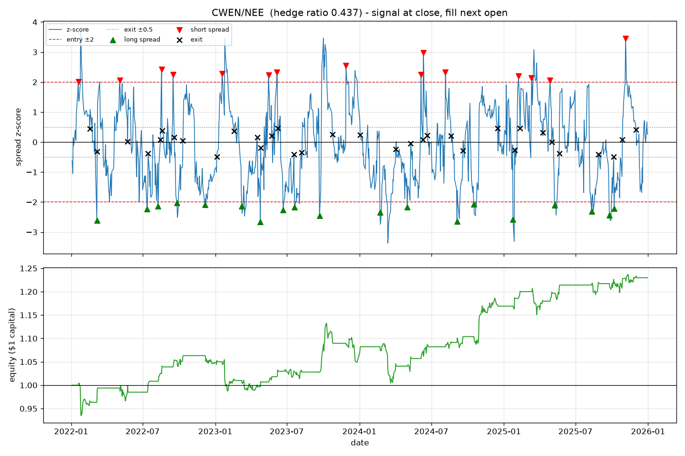

# Pairs Trading Research Pipeline: US Utilities

[](https://github.com/NirajNamburi/pairs-trading-research-pipeline/actions/workflows/ci.yml)

An end-to-end statistical-arbitrage research pipeline in Python, applied to the **50 largest US
utility stocks by market capitalisation that have a continuous 2019-2025 price history** (S&P
1500 Utilities constituents; the selection is scripted and auditable, see below). It screens
every pair for cointegration, trades the spread with a rolling z-score signal, and backtests the
strategy **out of sample** with realistic slippage and commissions. It is a research tool, not a
trading system: nothing here connects to a broker.

**Headline result.** Utilities are the sector where pairs trading *should* work, and at first
sight the screen agrees: 94 of 1,225 pairs pass an Engle-Granger test at p < 0.05 against about
61 expected by chance. The excess is not 33 extra relationships, though. 71 of the 94 involve
AEP, Dominion or PG&E, whose own prices test as stationary over 2019-2021 (ADF p < 0.01), so
Engle-Granger rejects for them against almost any partner; among the 1,081 pairs involving none
of the three, 23 pass (2.1%), fewer than chance. Out of sample the typical trade converges (the
median trade makes 103 bps gross in 12 days), but a fat left tail of spreads that never converge
drags the average gross gain to 24 bps against 30 bps to get in and out, so the textbook
strategy loses money after costs: an equal-weight portfolio of the 68 tradeable pairs finished
four years with a Sharpe ratio of **-0.09 net of costs** versus **+0.36 with costs switched
off**, and even the gross figure is statistically indistinguishable from zero over four years.
The 64% win rate is a property of the rolling z-score exit rule, which wins about the same share
of trades on a pure random walk, not evidence of mean reversion.


## Results

Formation (screening) period 2019-01-01 to 2021-12-31 (757 trading days). Out-of-sample trading
period 2022-01-03 to 2025-12-31 (1,003 trading days). 50 tickers, 1,225 pairs tested, 68
backtested.

| Equal-weight portfolio, all 68 pairs | 10 bps slippage + 5 bps commission (default) | 5 bps + 5 bps | Zero costs |
|---|---|---|---|
| Sharpe ratio (annualised, rf = 0) | **-0.09** | 0.06 | 0.36 |
| Annualised return on allocated capital | -0.47% | 0.33% | 1.94% |
| Max drawdown | -11.1% | -10.8% | -10.3% |
| Pairs profitable | 37 / 68 | 39 / 68 | 49 / 68 |
| Win rate | 63.6% | 65.3% | 68.2% |
| Trades | 2,167 | 2,167 | 2,167 |
| Average holding period | 14.8 trading days | same | same |

On the portfolio's capital the strategy earned **7.7%** gross over four years and paid **9.6%**
in slippage and commissions: costs were 124% of gross profit. Per trade, the average gross gain
was 24 bps of notional and the average round-trip cost 30 bps (15 bps in, 15 bps out).

| Year | Portfolio P&L, net |
|---|---|
| 2022 | -7.2% |
| 2023 | +5.2% |
| 2024 | -1.1% |
| 2025 | +1.2% |

The 2022 loss came almost entirely from September to November 2022 (September alone: -6.3%),
when utilities sold off sharply as rates rose and spreads fitted on 2019-2021 blew out together
rather than reverting.

The best single pair, Clearway Energy against NextEra, returned 23% with a Sharpe of 0.68 over 34
trades. It is shown because it is the best, which is exactly why it should not be read as
representative.



Full outputs are in [`reports/`](reports/): the ranked [pair table](reports/pair_results.csv),
every [trade](reports/trades.csv), all [screened pairs](reports/screened_pairs.csv) and a
[JSON summary](reports/summary.json).

### What the screen actually found, in three catches

**Catch one: the excess over chance is three stocks, not 33 relationships.** Engle-Granger
assumes both price series are integrated of order one, and three of the 50 clearly are not: AEP,
Dominion and PG&E each reject a unit root on their own 2019-2021 closes at p < 0.01 (ADF
p = 0.005, 0.004 and 0.006; four more, SRE, ATO, ETR and CMS, reject at p < 0.05). When the
regressand is already stationary the residual is stationary whatever the
partner, so those three tickers pass in 71 of the 144 pairs they appear in (49%), while the
other 1,081 pairs pass at 2.1% (23 pairs), below the 5% nominal rate. The asymmetry of the test
shows the same thing: Dominion passes in 25 of 37 pairs where it is the regressand and 0 of 12
where it is the regressor, PG&E in 12 of 14 versus 6 of 35. The pipeline has no unit-root
pretest on the individual series (listed under known simplifications), so "94 against 61
expected by chance" is not evidence of pairwise cointegration: the 1,225 p-values share
tickers, and the whole excess is three names that happened to be range-bound in 2019-2021.

**Catch two: more than a quarter of the "cointegrated" pairs (26 of 94) had a negative hedge
ratio,** meaning the two stocks moved in *opposite* directions in 2019-2021. Twelve of the 26
involve PG&E, which fell 54% in 2019, the year it filed for Chapter 11, while all but two of the
other 49 rallied (median +25%); over 2020-2021 it tracked the sector. Nine involve Dominion,
which announced a dividend cut and the sale of its gas transmission business in July 2020 and
then returned 0.3% through the end of 2021 while the median utility returned 28%. Both names
also pass with positive slopes (PG&E six times, Dominion sixteen), which is what a stationary
single name paired with anything looks like; the six positive-slope PG&E pairs were backtested
and all lost. A negative-slope "pair" of two same-sector stocks has no economic rationale, so
the pipeline requires a positive hedge ratio and backtests the remaining 68. This is a concrete
example of why a statistical test alone is not a trading rule.

**Catch three: the 68 pairs are not 68 independent bets.** AEP appears in 28 of them and
Dominion in 16, because their own 2019-2021 prices were range-bound rather than because of any
relationship: in 22 of those 44 pairs the hedge ratio puts under 16% of the notional in the
other leg (D/PNW puts 0.4%), so the "pair" is mostly an outright position in AEP or Dominion.
Net exposure to AEP alone averages 15% of portfolio capital and peaks at 36%. The equal-weight
portfolio is therefore two correlated bets plus a tail: the daily P&Ls of the AEP pairs have an
average pairwise correlation of 0.60 and the Dominion pairs 0.69, against 0.06 for the other 24
pairs, and the AEP and Dominion pairs produced 85% of the September 2022 loss. This
concentration is not why the drawdown (-11%) is deeper than the three-sector comparison's
(-4%): dropping the 28 AEP pairs makes the drawdown -12%, and a utilities-only run of the S&P
500 list at the comparison's 5 bps draws down -10% with AEP in 12 of its 27 pairs. The gap is
sector dilution: the comparison's energy and financials pairs sat out the September 2022
utilities sell-off, in which the 50 names fell 11% on average (49 of 50 were down).

### Sensitivity

The two variants that trade materially more (window 20, entry 1.5) do markedly worse. The only
two variants with a positive Sharpe at default costs, the 60-day window and the p < 0.01 screen,
both have far fewer trades in total (the p < 0.01 screen because it keeps only 9 pairs). Trading
less is not sufficient on its own, though: raising the entry threshold to 2.5 removes 46% of
trades, more than the 60-day window removes, yet also halves the gross edge and leaves the
Sharpe at -0.09 with fewer profitable pairs. The stop at |z| > 4 is a no-op (three extra trades
in four years, because a 30-day rolling z-score re-centres before a blown-out spread reaches 4).
The pattern is still that of a strategy whose edge is smaller than its costs.

| Variant | Backtested | Profitable | Sharpe | Trades | Avg hold (days) |
|---|---|---|---|---|---|
| Baseline (window 30, entry 2.0, exit 0.5, 10 + 5 bps) | 68 | 37 | -0.09 | 2,167 | 14.8 |
| 5 bps slippage instead of 10 | 68 | 39 | 0.06 | 2,167 | 14.8 |
| Zero costs | 68 | 49 | 0.36 | 2,167 | 14.8 |
| Window 20 | 68 | 20 | -0.40 | 2,666 | 11.1 |
| Window 60 | 68 | 40 | 0.23 | 1,290 | 24.6 |
| Entry 1.5 | 68 | 18 | -0.37 | 2,915 | 13.8 |
| Entry 2.5 | 68 | 33 | -0.09 | 1,176 | 16.9 |
| Stop at |z| > 4 | 68 | 36 | -0.08 | 2,170 | 14.8 |
| p-value < 0.01 | 9 | 6 | 0.17 | 276 | 13.9 |

### What the results mean

1. **The evidence for out-of-sample mean reversion is weak, and the loss is a fat tail, not
   slow convergence.** The 22-day median half-life is fitted on the formation period. Out of
   sample the typical trade works: the median trade makes 103 bps gross in 12 days, three times
   the round-trip cost. The mean is dragged to 24 bps by the tail: losers average -350 bps, and
   the worst 20 of 2,167 trades erase two thirds of gross profit. Those trades exit because the
   30-day window re-centres on the new spread level, not because the spread came back. The
   gross portfolio Sharpe of 0.36 over four years has a standard error of about 0.5, so even
   before costs the strategy is not distinguishable from zero.
2. **Statistical significance is not tradeability.** The screen beat chance by 50%, but the
   excess came from three stationary single names, more than a quarter of what it found (26 of
   94) had a negative slope, and nearly half of that (12 of 26) was PG&E's bankruptcy in
   disguise.
3. **Slower is better.** The 60-day window cuts the trade count by 40%, lengthens the average
   hold from 15 to 25 days and has the best Sharpe of any variant at default costs (0.23); the
   only other variant above zero after default costs is the stricter p < 0.01 screen (0.17, on
   9 pairs and 276 trades). Neither is statistically distinguishable from zero over four years,
   but the direction is consistent: longer holding periods amortise the fixed cost of getting
   in and out.
4. **A single sector concentrates regime risk.** One bad quarter in 2022 produced a drawdown
   the strategy never fully recovered from.

## Why utilities

The sector was chosen from evidence, not preference. The same pipeline was first run on 89 S&P
500 stocks across three sectors, pairing only within each sector, on the same dates and with 5
bps slippage (full outputs in [`reports/comparison_sp500_sectors/`](reports/comparison_sp500_sectors/)):

| Sector (S&P 500 only) | Pairs tested | Passed p < 0.05 | Pass rate | Profitable / backtested |
|---|---|---|---|---|
| Utilities | 378 | 30 | **7.9%** | 18 / 27 |
| Energy | 171 | 10 | 5.8% | 0 / 10 |
| Financials | 861 | 34 | 3.9% | 17 / 34 |

Three utilities pairs (D/NRG, ATO/NEE, ATO/AWK) passed the p-value test with a negative hedge
ratio and were not backtested; 74 pairs passed and 71 were backtested in total.

Utilities had by far the highest pass rate (energy's 5.8% is within noise of the 5% chance
rate) and was the only sector with a positive average out-of-sample Sharpe. With hindsight the
excess has the same source as in the top-50 run: 22 of the 30 utilities passes involve AEP or
Dominion (PG&E is not in the S&P 500 list), and the other 325 utilities pairs pass at 2.5%.
Regulated utilities sell the same product
under similar rate-setting rules and respond to the same interest rates, so they are as close to
interchangeable as public companies get. Energy pairs were broken by the 2022 oil shock;
financials lump together banks, insurers and payment networks that have little reason to pair.
The three-sector portfolio finished with a Sharpe of exactly 0.00, so the utilities deep dive
did not change the conclusion, but it did test it in the sector most likely to overturn it.

## The universe: how the 50 were chosen

The list is generated by a script, not typed by hand, so "top 50 by market cap with a full
price history" is a claim you can audit and rerun:

```bash
pip install -e ".[universe]"
python -m pairs_trading.universe_selection --n 50 --start 2019-01-01 --end 2025-12-31
```

1. **Candidates:** every company in the GICS Utilities sector of the S&P 500, S&P MidCap 400
   and S&P SmallCap 600, read from Wikipedia's constituent tables. 60 listings, 59 companies
   after collapsing share classes.
2. **Eligibility:** a continuous daily price history over 2019 to 2025 (at most 2% of trading
   days missing). Constellation Energy ($92 billion, which would rank third; separated from
   Exelon on 1 February 2022, with Yahoo history starting 19 January 2022 in when-issued
   trading) and Talen Energy ($14 billion; relisted June 2023) fail this and are excluded.
3. **Ranking:** market capitalisation from Yahoo Finance on the selection date (2026-09-16),
   descending; take the top 50. Seven eligible small caps fall below the cut.

The result is committed as [`utilities_top50.json`](src/pairs_trading/universes/utilities_top50.json)
with every member's rank, market cap and index, and every excluded candidate's reason. The 50
span $3.1 billion to $168 billion in market cap (median $20 billion): 30 from the S&P 500, 14
from the MidCap 400, 6 from the SmallCap 600; by sub-industry 18 electric, 17 multi-utility,
8 gas, 3 water, 2 independent power producers and 2 renewable generators.

Two caveats are stated rather than hidden. Market caps and index membership are as of the
selection date, not 2019, so the universe is tilted toward companies that grew (survivorship
bias); fixing that needs point-in-time constituent data, which is not free. And a "top 50" that
reaches into small caps is less liquid than the S&P 500, which is why the default slippage
assumption is 10 bps rather than the 5 bps that would be typical for megacaps.

## How it works

```
Stage 1  data.py              yfinance -> Parquet cache -> cleaned close/open matrices
Stage 2  cointegration.py     Engle-Granger test on every pair (formation period only)
Stage 3  signals.py           spread = A - beta*B, rolling z-score, +/-2 entry, +/-0.5 exit
Stage 4  backtest.py          day-by-day simulation, next-open execution, slippage + commission
Stage 5  report.py            ranked table, trade log, JSON/markdown summary, charts
         universe_selection.py  builds the top-N universe (run once; output is committed)
```

1. **Data.** Adjusted daily closes and opens for the 50 tickers, cached locally as Parquet.
   Gaps of up to three days are forward-filled; a ticker missing more than 2% of days would be
   dropped, though the universe is built so that none is. Only tickers that actually downloaded
   are written to the cache, so a rate-limited run can never silently shrink the universe.
2. **Cointegration screen.** For each pair, regress A on B to get the hedge ratio, then test the
   residual spread for stationarity with `statsmodels.tsa.stattools.coint` (Engle-Granger). Keep
   pairs with p < 0.05 and a positive hedge ratio. The spread's mean-reversion half-life is
   estimated from an AR(1) fit and reported alongside. The screen is O(n²) in tickers and runs
   across processes with `--n-jobs`.
3. **Signal.** Spread z-score over a trailing 30-day window. Decided at each day's close: go
   short the spread above +2, long below -2, flat inside ±0.5.
4. **Backtest.** A position decided at the close of day *t* is filled at the open of day *t+1*.
   Each trade puts $1 of gross notional on, hedge-ratio weighted, with quantities fixed for the
   life of the trade. Slippage of 10 bps moves every fill against the trader on both legs, and
   commission of 5 bps is charged on notional traded, on entry and on exit. P&L is marked to
   market daily. Open positions on the last day are force-closed so every trade is realised.
5. **Report.** Per-pair and portfolio metrics (Sharpe, annualised return, max drawdown, win
   rate, holding period), plus charts for the top pairs.

## Design decisions

**Why cointegration, not correlation.** Two stocks can be highly correlated in returns and still
drift apart permanently in price. Cointegration tests the property the strategy needs: that the
spread is stationary and therefore mean-reverting.

**Why a formation / trading split.** Screening pairs on the same data you then backtest is
selection bias: the spread looks mean-reverting because you chose it for looking mean-reverting.
Pairs and hedge ratios are fixed on 2019-2021 and the backtest runs only on 2022-2025, following
the formation/trading design of Gatev, Goetzmann and Rouwenhorst (2006). The rolling z-score is
warmed up on the last 30 closes of the formation period so a signal exists on trading day one.

**Why signal at close, execute at next open.** You cannot trade at a closing price you have only
just observed. Filling at the next open removes that look-ahead. A unit test perturbs the close
on the signal day and asserts that day's P&L is unchanged.

**Why model costs at all.** Pairs strategies live on thin margins. Switching costs off turns a
losing strategy into a Sharpe of 0.36, which is the whole point: ignoring costs makes an
unprofitable strategy look profitable. Both cost constants sit at the top of
[`config.py`](src/pairs_trading/config.py) so they are easy to find and change.

**Why 10 bps slippage + 5 bps commission.** A simplified, conservative estimate. The universe
reaches into mid-caps and small-caps where bid-ask spreads are wider than for megacaps, so the
slippage assumption is doubled from the 5 bps used in the S&P 500 comparison. A better model
would make slippage a function of trade size relative to average daily volume (market impact);
that is out of scope for this version.

**Why fixed ±2 / ±0.5 thresholds.** The classic textbook rule. Real desks tune thresholds per
pair or use adaptive hedge ratios (Kalman filters). This is a documented simplification, not an
oversight.

**Why require a positive hedge ratio.** A negative slope means the two stocks moved in opposite
directions during formation. Between two utilities that is a symptom of one of them having a
crisis (PG&E, Dominion), not a relationship to trade. The filter removed 26 of 94 pairs.

**Why $1 gross notional and an equal-weight portfolio.** A Sharpe ratio is meaningless until the
capital base is defined. Every trade uses $1 of gross notional, split between the legs by the
hedge ratio, and the portfolio splits capital evenly across all 68 pairs whether or not they are
in the market. The headline number is the portfolio's, not the best pair's.

**Known simplifications, stated up front.** There is no unit-root pretest on the individual
price series, which is the standard first step of Engle-Granger; three of the 50 (AEP, Dominion,
PG&E) reject a unit root at p < 0.01 over the formation period and account for 71 of the 94
passes (seven reject at p < 0.05).
Engle-Granger is not symmetric in (A, B); only the alphabetical ordering is tested. The
regression is on price levels, not log prices. Capital is not compounded (equity is 1 +
cumulative P&L). The pairs overlap heavily in AEP and Dominion, so the portfolio is less
diversified than its pair count suggests. The universe is selected as of 2026, so it is subject
to survivorship bias.

## Non-goals

- No live trading or broker integration.
- No adaptive hedge ratios (Kalman filtering).
- No market-impact model; flat basis-point costs only.
- No walk-forward re-estimation; one formation period, one trading period.
- No machine learning.

## Running it

Requires Python 3.11+.

```bash
python -m venv .venv
.venv\Scripts\activate            # Windows cmd
.venv\Scripts\Activate.ps1        # Windows PowerShell
source .venv/bin/activate         # macOS/Linux; Git Bash on Windows: source .venv/Scripts/activate
pip install -e ".[dev]"

python -m pairs_trading run                  # utilities_top50, 2019-2021 formation, 2022-2025 trading
python -m pairs_trading run --n-jobs 4       # parallel cointegration screen
python -m pairs_trading run --help           # dates, thresholds, costs and outputs are flags
```

The first run downloads seven years of daily data from Yahoo Finance and caches it under
`data/`; later runs take about 25 seconds single-process, or about 15 seconds with `--n-jobs 4`.
Outputs land in `reports/`.

Useful variants:

```bash
python -m pairs_trading run --slippage-bps 0 --commission-bps 0     # what costs are doing
python -m pairs_trading run --zscore-window 60                       # slower signal
python -m pairs_trading run --pvalue 0.01                            # stricter screen
python -m pairs_trading run --stop-z 4                               # add a blow-out stop
# the three-sector comparison, exactly as committed (no pair charts, four processes)
python -m pairs_trading run --sectors energy financials utilities --slippage-bps 5 \
    --n-plot-pairs 0 --n-jobs 4 --reports-dir reports/comparison_sp500_sectors
```

Tests and lint (no network access needed; CI runs the same commands):

```bash
pytest
ruff check . && ruff format --check .
```

## Project layout

```
src/pairs_trading/
  config.py              PipelineConfig dataclass; every assumption lives here
  universe.py            hardcoded S&P 500 sectors + loader for generated universes
  universe_selection.py  builds universes/utilities_top50.json (Wikipedia + yfinance)
  universes/             committed universe files with selection criteria and exclusions
  data.py                download, cache, clean, formation/trading split
  cointegration.py       Engle-Granger screen, hedge ratio, half-life
  signals.py             spread, rolling z-score, entry/exit state machine
  backtest.py            event-driven simulator with costs; Trade and PairResult records
  metrics.py             Sharpe, drawdown, win rate, holding period
  report.py              CSV / JSON / markdown outputs and matplotlib charts
  pipeline.py            run_pipeline(): the five stages in order
  cli.py                 argparse entry point
tests/                   synthetic-data unit tests for every stage; none touch the network
reports/                 outputs of the default run, plus the three-sector comparison
.github/workflows/       CI: ruff + pytest on every push to main and every pull request
```

The tests cover the things the results depend on: a hand-computed six-day round trip checks
every fill price, slippage and commission; a look-ahead test shocks the signal-day close and
asserts nothing changes; a synthetic cointegrated pair must pass the screen and two random walks
must fail it; the parallel screen must match the serial one exactly; and the committed universe
file must satisfy its own stated criteria.

## What I would do next

1. **Walk-forward re-estimation.** Re-screen and re-fit hedge ratios every six months instead
   of once, as in the original Gatev et al. design, so 2025 is not traded on 2021 hedge ratios.
2. **Trade less.** The sensitivity table says whatever edge exists is smaller than costs. The
   60-day window already helps; a minimum half-life filter or a profit target would cut turnover
   further.
3. **Control the AEP concentration.** Cap the number of pairs any one stock can appear in, or
   weight pairs so each stock's net exposure is bounded.
4. **Adaptive hedge ratio.** A Kalman filter would let the hedge ratio drift with the
   relationship instead of freezing it in 2021.
5. **Unit-root pretest and multiple-testing control.** Test each series for a unit root before
   pairing it (that drops the seven tickers that reject a unit root at p < 0.05 over the
   formation period, AEP, Dominion and PG&E among them, and with them most of the 94 passes),
   then Benjamini-Hochberg
   on the remaining p-values, or cointegration required in two disjoint sub-periods, to
   separate whatever real pairs remain from the false positives.
6. **Survivorship-free universe.** Point-in-time index membership from a proper data vendor.
