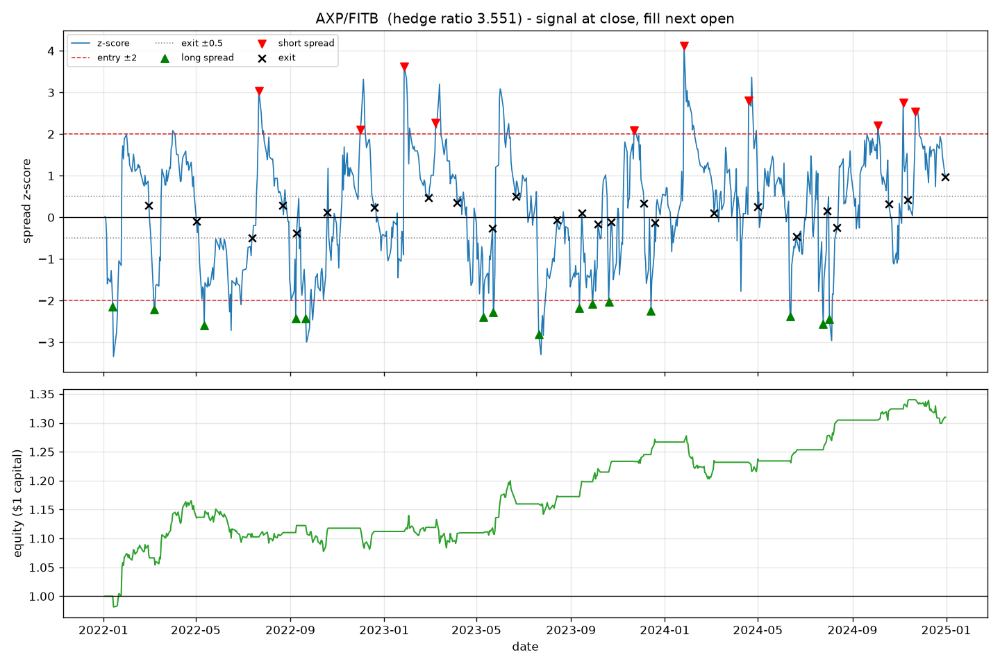

# Pairs Trading Research Pipeline

[](https://github.com/NirajNamburi/pairs-trading-research-pipeline/actions/workflows/ci.yml)

An end-to-end statistical-arbitrage research pipeline in Python. It screens S&P 500 stocks for
cointegrated pairs, trades the spread with a rolling z-score signal, and backtests the strategy
**out of sample** with realistic slippage and commissions. It is a research tool, not a trading
system: nothing here connects to a broker.

**Headline result:** the textbook pairs strategy (Engle-Granger screen, ±2 z-score entry, ±0.5
exit) has a small positive gross edge on 2022-2024 data, and transaction costs consume all of it.
An equal-weight portfolio of the 71 cointegrated pairs finished the three-year out-of-sample
period with a Sharpe ratio of **-0.06 net of costs** versus **+0.51 with costs switched off**.
The number of pairs passing the cointegration screen at p < 0.05 (74, of which 71 also had a
positive hedge ratio and were backtested) is almost exactly what chance alone would produce
(70.5), which is the more important finding.


## Results

Formation (screening) period 2019-01-01 to 2021-12-31. Out-of-sample trading period 2022-01-03
to 2024-12-31 (753 trading days). 89 tickers in three sectors, 1,410 within-sector pairs tested.

| Metric (equal-weight portfolio, all 71 pairs) | Net of costs | Zero costs |
|---|---|---|
| Sharpe ratio (annualised, rf = 0) | **-0.06** | 0.51 |
| Annualised return on allocated capital | -0.16% | 1.36% |
| Max drawdown | -4.34% | -3.77% |
| Pairs profitable | 33 / 71 | 45 / 71 |
| Trades | 1,605 | 1,605 |
| Win rate | 62.7% | 65.5% |
| Average holding period | 15.5 trading days | 15.5 trading days |

On the portfolio's capital the strategy earned **4.1%** gross over the three years and paid
**4.5%** in slippage and commissions, so costs were 112% of gross profit (summed over the 71
pair books, each trading $1 of gross notional, that is $2.89 gross against $3.22 of costs). The
average round trip costs 20 basis points of notional (10 on entry, 10 on exit), and the average
trade only captures about 18 basis points of spread convergence.

The best single pair, AXP/FITB, returned 31% with a Sharpe of 1.14 over 25 trades. It is shown
below because it is the best, which is exactly why it should not be read as representative.



Full outputs are in [`reports/`](reports/): the ranked
[pair table](reports/pair_results.csv), every [trade](reports/trades.csv), all
[screened pairs](reports/screened_pairs.csv), and a [JSON summary](reports/summary.json).

### Sensitivity

Every variant that trades more often does worse, and every variant that trades less does better.
That pattern is what you expect when costs, not signal, dominate.

| Variant | Pairs backtested | Profitable | Sharpe | Trades | Avg hold (days) |
|---|---|---|---|---|---|
| Baseline (window 30, entry 2.0, exit 0.5) | 71 | 33 | -0.06 | 1,605 | 15.5 |
| Zero costs | 71 | 45 | 0.51 | 1,605 | 15.5 |
| Window 20 | 71 | 29 | -0.28 | 2,089 | 11.2 |
| Window 60 | 71 | 37 | 0.18 | 966 | 26.4 |
| Entry 1.5 | 71 | 29 | -0.47 | 2,234 | 14.1 |
| p-value < 0.01 | 15 | 10 | 0.77 | 336 | 15.1 |

The stricter p-value looks promising but rests on 15 pairs, of which about 14 would pass by
chance, so it is not evidence of anything yet.

### What the results mean

1. **Mean reversion exists but is too weak to pay for daily execution.** The 62.7% win rate and
   the positive zero-cost Sharpe show the spreads do revert. The edge per trade is simply
   smaller than 20 bps.
2. **The screen is not finding more cointegration than chance.** At p < 0.05 across 1,410 tests
   you expect about 70 false positives; the screen found 74 (71 after requiring a positive
   hedge ratio). Cointegration measured on 2019-2021 says little about 2022-2024.
3. **Energy pairs were the worst sector.** None of the 10 energy pairs were profitable; the 2022
   energy shock broke every relationship fitted on 2019-2021.

## How it works

```
Stage 1  data.py           yfinance -> Parquet cache -> cleaned close/open matrices
Stage 2  cointegration.py  Engle-Granger test on every within-sector pair (formation period only)
Stage 3  signals.py        spread = A - beta*B, rolling z-score, +/-2 entry, +/-0.5 exit
Stage 4  backtest.py       day-by-day simulation, next-open execution, slippage + commission
Stage 5  report.py         ranked table, trade log, JSON/markdown summary, charts
```

1. **Data.** Adjusted daily closes and opens for 89 S&P 500 tickers in Energy, Financials and
   Utilities, cached locally as Parquet. Tickers with more than 2% missing data are dropped and
   gaps of up to three days are forward-filled. Only tickers that actually downloaded are
   written to the cache, so a rate-limited run can never silently shrink the universe on later
   runs.
2. **Cointegration screen.** For each same-sector pair, regress A on B to get the hedge ratio,
   then test the residual spread for stationarity with `statsmodels.tsa.stattools.coint`
   (Engle-Granger). Keep pairs with p < 0.05 and a positive hedge ratio. The mean-reversion
   half-life of the spread is estimated from an AR(1) fit and reported alongside. The screen is
   O(n²) in tickers and can be spread across processes with `--n-jobs`.
3. **Signal.** Spread z-score over a trailing 30-day window. Decided at each day's close:
   go short the spread above +2, long below -2, flat inside ±0.5.
4. **Backtest.** A position decided at the close of day *t* is filled at the open of day *t+1*.
   Each trade puts $1 of gross notional on, hedge-ratio weighted, with quantities fixed for
   the life of the trade. Slippage of 5 bps moves every fill against the trader on both legs,
   and commission of 5 bps is charged on notional traded, on entry and on exit. P&L is marked
   to market daily. Open positions on the last day are force-closed so every trade is realised.
5. **Report.** Per-pair and portfolio metrics (Sharpe, annualised return, max drawdown, win
   rate, holding period), plus charts for the top pairs.

## Design decisions

**Why cointegration, not correlation.** Two stocks can be highly correlated in returns and still
drift apart permanently in price. Cointegration tests the property the strategy needs: that the
spread is stationary and therefore mean-reverting.

**Why a formation / trading split.** Screening pairs on the same data you then backtest is
selection bias: the spread looks mean-reverting because you chose it for looking mean-reverting.
Pairs and hedge ratios are fixed on 2019-2021 and the backtest runs only on 2022-2024, following
the formation/trading design of Gatev, Goetzmann and Rouwenhorst (2006). The rolling z-score is
warmed up on the last 30 closes of the formation period so a signal exists on trading day one.

**Why signal at close, execute at next open.** You cannot trade at a closing price you have only
just observed. Filling at the next open removes that look-ahead. A unit test perturbs the close
on the signal day and asserts that day's P&L is unchanged.

**Why model costs at all.** Pairs strategies live on thin margins. The zero-cost run above turns
a losing strategy into a Sharpe of 0.5, which is the whole point: ignoring costs makes an
unprofitable strategy look profitable. Both cost constants sit at the top of
[`config.py`](src/pairs_trading/config.py) so they are easy to find and change.

**Why 5 bps + 5 bps.** A simplified, conservative estimate for liquid large-cap US equities. A
better model would make slippage a function of trade size relative to average daily volume
(market impact); that is out of scope for this version.

**Why fixed ±2 / ±0.5 thresholds.** The classic textbook rule. Real desks tune thresholds per
pair or use adaptive hedge ratios (Kalman filters). This is a documented simplification, not an
oversight.

**Why within-sector pairs only.** Same-sector pairs have an economic reason to be cointegrated,
and restricting the search from 3,916 to 1,410 pairs cuts the number of false positives the
p < 0.05 screen produces. Even so, the screen found no more cointegrated pairs than chance
predicts, which is reported rather than hidden.

**Why $1 gross notional and an equal-weight portfolio.** A Sharpe ratio is meaningless until the
capital base is defined. Every trade uses $1 of gross notional, split between the legs by the
hedge ratio, and the portfolio splits capital evenly across all 71 pairs whether or not they are
in the market. The headline number is the portfolio's, not the best pair's.

**Known simplifications, stated up front.** Engle-Granger is not symmetric in (A, B); only the
alphabetical ordering is tested. The regression is on price levels, not log prices. Capital is
not compounded (equity is 1 + cumulative P&L). The universe is today's constituents, so stocks
that left the index between 2019 and 2024 are missing (survivorship bias); free data cannot
easily fix this.

## Non-goals

- No live trading or broker integration.
- No adaptive hedge ratios (Kalman filtering).
- No market-impact model; flat basis-point costs only.
- No walk-forward re-estimation; one formation period, one trading period.
- No machine learning.

## Running it

Requires Python 3.11+.

```bash
python -m venv .venv
.venv/Scripts/activate            # Windows;  source .venv/bin/activate on macOS/Linux
pip install -e ".[dev]"

python -m pairs_trading run                  # default: 2019-2021 formation, 2022-2024 trading
python -m pairs_trading run --n-jobs 4       # parallel cointegration screen
python -m pairs_trading run --help           # every parameter is a flag
```

The first run downloads about six years of daily data from Yahoo Finance and caches it under
`data/`; later runs take under 30 seconds. Outputs land in `reports/`.

Useful variants:

```bash
python -m pairs_trading run --slippage-bps 0 --commission-bps 0     # what costs are doing
python -m pairs_trading run --zscore-window 60                       # slower signal
python -m pairs_trading run --pvalue 0.01                            # stricter screen
python -m pairs_trading run --stop-z 4                               # add a blow-out stop
python -m pairs_trading run --sectors energy                         # one sector
```

Tests and lint (no network access needed; CI runs the same commands):

```bash
pytest
ruff check . && ruff format --check .
```

## Project layout

```
src/pairs_trading/
  config.py         PipelineConfig dataclass; every assumption lives here
  universe.py       S&P 500 tickers by sector
  data.py           download, cache, clean, formation/trading split
  cointegration.py  Engle-Granger screen, hedge ratio, half-life
  signals.py        spread, rolling z-score, entry/exit state machine
  backtest.py       event-driven simulator with costs; Trade and PairResult records
  metrics.py        Sharpe, drawdown, win rate, holding period
  report.py         CSV / JSON / markdown outputs and matplotlib charts
  pipeline.py       run_pipeline(): the five stages in order
  cli.py            argparse entry point
tests/              synthetic-data unit tests for every stage
reports/            outputs of the default run, committed so results are visible here
.github/workflows/  CI: ruff + pytest on every push
```

The tests cover the things the results depend on: a hand-computed six-day round trip checks
every fill price, slippage and commission; a look-ahead test shocks the signal-day close and
asserts nothing changes; a synthetic cointegrated pair must pass the screen and two random
walks must fail it; and the parallel screen must match the serial one exactly.

## What I would do next

1. **Walk-forward re-estimation.** Re-screen and re-fit hedge ratios every six months instead
   of once, as in the original Gatev et al. design.
2. **Adaptive hedge ratio.** A Kalman filter would let the hedge ratio drift with the
   relationship instead of freezing it in 2021.
3. **Trade less.** The sensitivity table says the edge is real but smaller than costs. Wider
   entry bands, a minimum half-life filter, or holding to a target profit would cut turnover.
4. **Multiple-testing control.** Benjamini-Hochberg on the 1,410 p-values, or requiring
   cointegration in two disjoint sub-periods, would separate real pairs from the 70 expected
   false positives.
5. **Survivorship-free universe.** Point-in-time index membership from a proper data vendor.
